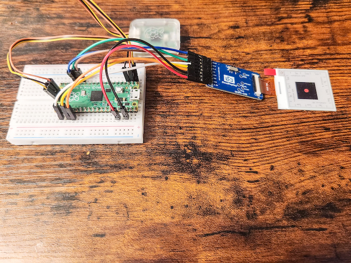

# pico-gdepd
Raspberry Pi Pico example for Dalian Good Display Tri-Color e-ink display 1.54 inch e-ink small display screen, [GDEM0154Z90](https://www.good-display.com/product/436.html) using DESPI-C02 adapter https://buyepaper.com/products/development-kit-connection-adapter-board-for-eaper-display-demo-kit

---

